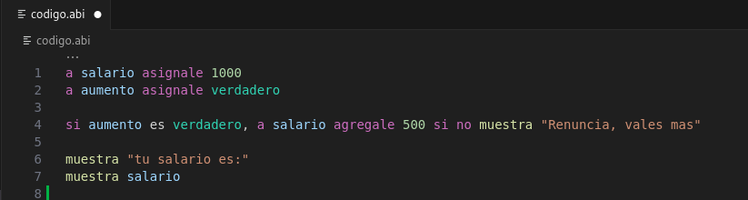
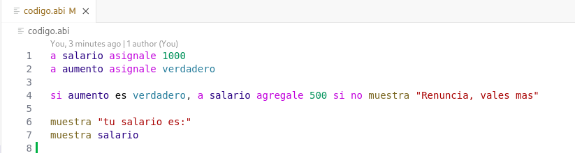
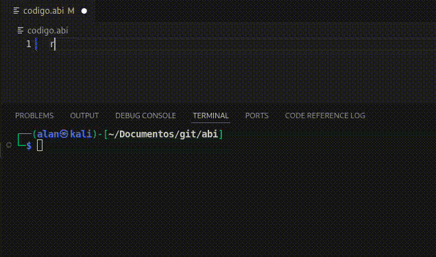

# abi lenguaje de programación en español

Lenguaje de programación en español, ideal para cualquier persona que va iniciando y tambien para experimentados

## Features

Tiene un bonito resaltado de colores para ayudarte a identificar funciones, variables, tipos de dato etc. 

Para Tema claro tambien

> Tip: Ademas de algunos cierres automaticos para comandos  con patrones especificos.

### 1.0.0

Lanzamiento inicial de extension para soporte de lenguaje
